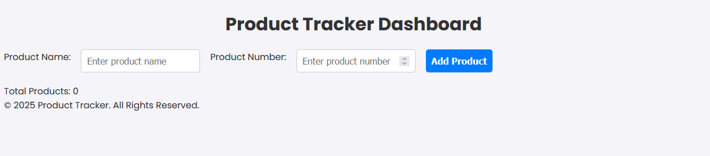
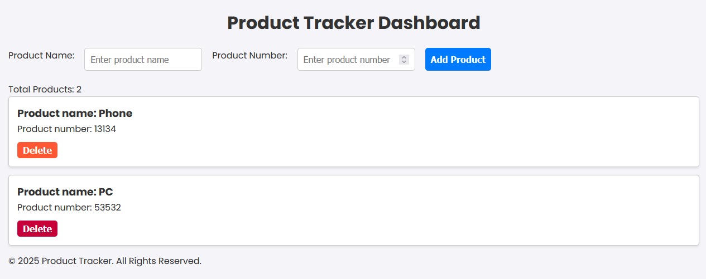
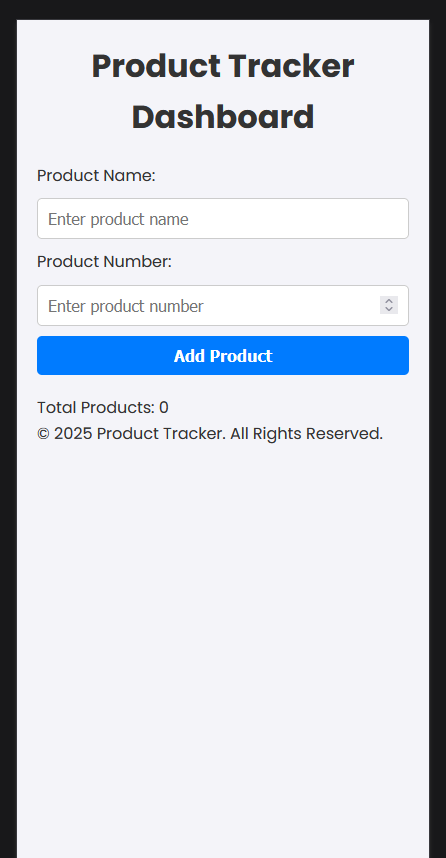
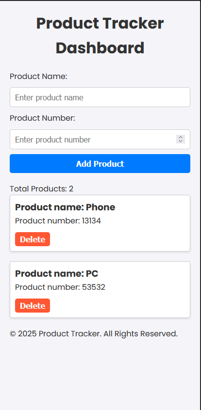

# Product Tracker Dashboard

A simple and dynamic web application to track products. Users can add products with a name and a number, view the list of products, and delete products as needed. The application dynamically updates the product count and features smooth animations for a modern user experience.

## Features
- Add new products with a name and number.
- Dynamically update the product list in real-time.
- Delete products from the list with a single click.
- Smooth animations for adding and removing product cards.
- Mobile-responsive design for better usability across devices.
- Real-time product counter to display the total number of products.

## Technologies Used
- **HTML5:** Semantic and accessible structure.
- **CSS3:** Responsive design with modern animations.
- **JavaScript (ES6+):** Dynamic interactivity and DOM manipulation.
- **Google Fonts:** Poppins font for a clean and modern look.

## Setup and Usage
1. Clone the repository or download the files.
2. Open `index.html` in your preferred web browser.
3. Start adding products by filling in the fields and clicking the "Add Product" button.

## Project Structure
Portfolio/ └── Product_Tracker/ ├── index.html ├── styles/ │ └── style.css ├── scripts/ │ └── main.js └── README.md

## Screenshots
### Desktop View

### Mobile View

## Future Improvements
- Add a search bar to filter products by name or number.
- Store products in local storage to preserve data on reload.
- Implement categories for better organization.

## License
This project is licensed under the MIT License.

---

Feel free to contribute or fork the repository to build upon this project!
